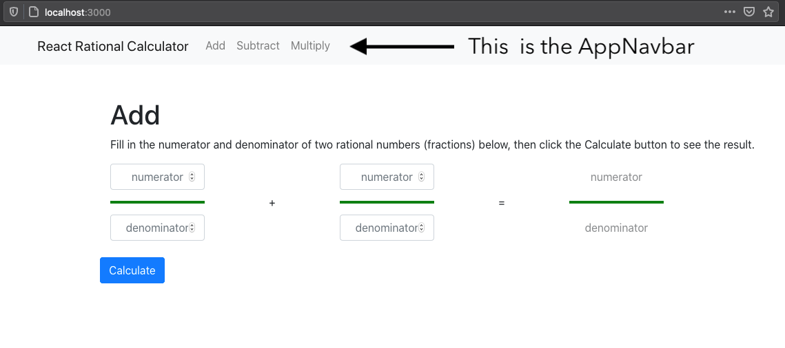
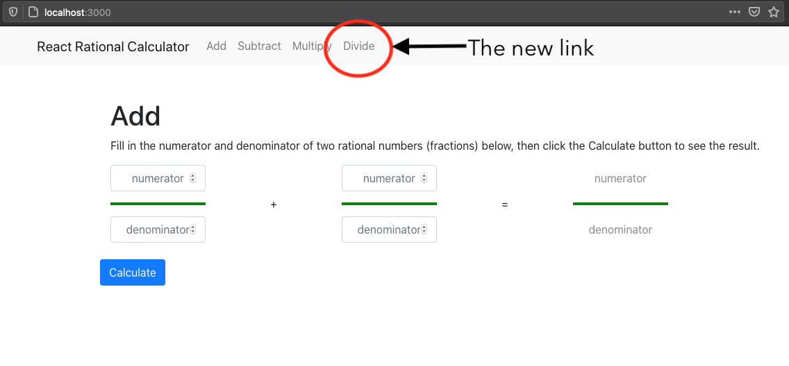
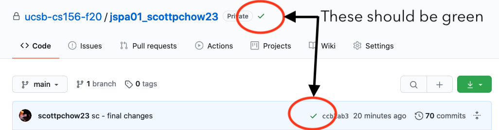

# jspa01

## Learning goals

By the end of this lab, you should have been exposed to the following:

- Installing and running a React application.
- Setting up CodeCov on your repo.
- Learning the basics of JavaScript:
  - How to throw an error.
  - The difference between `===` and `==` in JavaScript.
  - String interpolation with backticks and `${variable}`.
  - How imports and exports work in JavaScript.
  - The _basics_ of how classes work in JavaScript.
  - `this` in JavaScript and why it might differ from `this` and `self` in other languages.
  - Arrow functions.
  - De-structuring assignment and how it works.
  - The spread operator.
- Learning the basics of testing in JavaScript:
  - How to run tests in JavaScript.
  - How to filter tests by file and title.
  - How to read tests written in JavaScript.
- Learning the basics of React
  - How react components are created.
  - What React component tests look like.
  - How the XML syntax of `.jsx` files works.

Emphasis on **expose**. Learning JavaScript and React is a process and this is just to accustom you to some of the terms and concepts that we're going to be working with.

If you haven't looked through it already, this [article](https://developer.mozilla.org/en-US/docs/Web/JavaScript/A_re-introduction_to_JavaScript) by Mozilla serves as a good primer on JavaScript as well as touching on some of the topics above. We **strongly** recommend reading it through until the **Closures** heading to get a feel for the language.

## Setting up your repo

- Create your repo with the name `jspa01_joegaucho`
  - **Note**: replace `joegaucho` with your actual GitHub username for all remaining steps!
- Clone your repo: `git clone git@github.com:ucsb-cs156-f20/jspa01_joegaucho.git`
- Move into your repo's directory: `cd jspa01_joegaucho`
- Change your base branch to `main`: `git checkout -b main`
- Add the starter code to your repo:
  - `git remote add starter git@github.com:ucsb-cs156-f20/STARTER_jspa01.git`
  - `git pull starter main`
- Push your repo (now with starter code) to GitHub: `git push origin main`

## Getting the app running

You can find the instructions for getting started in the `README.md` file in the root project folder, but you'll find them restated below.

> Always `cd javascript` before running any of these commands.
>
> - `npm install` installs the necessary packages into `javascript/node_modules`. Note that the `javascript/node_modules`
>   directory can be completely deleted and rebuilt at any time (deleting
>   it is similar to a `make clean` or `mvn clean` command).
> - `npm start` starts up a web server on [http://localhost:3000](http://localhost:3000) where you can interact
>   with a web page.
> - `npm test` runs the unit tests for this project.

Keep in mind the following:

- `npm install` is going to take a long time to run, sometimes upwards of 10 minutes. This is particularly true if you've never worked with `npm` on your machine before.
- There should be 22 failing tests when you run `npm test`; don't worry, it's _supposed_ to be like that at the beginning.

If you're working over SSH on CSIL, the following notes may apply to you:

- `npm start` runs the app on CSIL, not your own computer. You'll need to set up port forwarding as detailed [here](https://ucsb-cs156.github.io/topics/csil_ssh_port_forwarding/) in order to be able to see the running application on a browser on your computer.
- Keep in mind that the port you want to capture on CSIL is `localhost:3000` and not `localhost:8080`.

If you can open up the app in your web browser and run the tests with `npm test`, go ahead and push your starting point to GitHub with `git push origin main`.

## Setting up CodeCov for your repo

We're now going to set up CodeCov for your project to track a testing metric called **code coverage** for your assignment.

You can follow the instructions found in `README.md` under the **Setting up Code Coverage** heading.

If you want some guidance on how to approach the remainder of the lab, then the rest of the lab is for you. Otherwise, if you're feeling adventurous then you can just dive into the app and start fixing the failing tests.

## Fixing up the Rational Class

If you ran the tests before, you might notice that there are _a lot_ of failing tests with an obnoxious amount of console output. First things first, we're going to cut down the number of tests being run by adding a filter:

```bash
npm test -- Rational.test.js
```

The `--` adds a filter to `npm test` that only runs test files that have a prefix that matches the following arguments. In this case, we want to focus on tests from `Rational.test.js`, so we used that. This narrows down the number of failing tests to 13, each with a much more manageable output.

- **Note**: we could also have used `Rational.test` in place of `Rational.test.js`, as it does prefix matching on filenames, including the file's path.

Our goal now is to fix all of the failing tests in `src/test/rationals/Rational.test.js` by editing `src/main/rationals/Rational.js`; no other file needs to be touched for this section.

- **Note**: each file being tested int `src/main` has a matching test file in `src/test`! The only difference is that implementation files end with only `.js` or `.jsx` while their testing counterparts end with `.test.js` or `.test.jsx`.

To reiterate: the first pair of files we'll be focusing on are:

- `src/main/rationals/Rational.js` - the implementation file we need to edit.
- `src/test/rationals/Rational.test.js` - the test file we **don't** edit.

Here is a suggested order for resolving the test suites (by class function):

### `constructor`

This may be your first time working with JavaScript, so we're going to go into a lot of detail for this step.

Let's take a look at the `constructor` method in the `Rational` class in `src/main/rationals/Rational.js`:

```javascript
// 1
import  {  gcd,  lcm  }  from  "./Helpers";

// 2
export  default  class  Rational  {
  // 3
  constructor(numerator,  denominator)  {
    if (typeof  numerator  !==  "number"  ||  typeof  denominator  !==  "number") {
      throw  new  Error(`Incorrect types passed to Rational constructor; got ${typeof  numerator} and ${typeof  denominator}`);
    }
    // 4
    this.numerator =  Math.trunc(numerator);
    this.denominator =  Math.trunc(denominator);
		      // 5
    if (this.numerator !==  0) {
      const  greatestCommonDivisor  =  gcd(this.numerator,  this.denominator);
      this.numerator /=  greatestCommonDivisor;
      this.denominator /=  greatestCommonDivisor;
    }
    // 6
  }
  ...
}
```

Here's the break down point by point:

1. This is how you import code from other _modules_ (JavaScript files); you can find a more detailed explanation [here](https://developer.mozilla.org/en-US/docs/web/javascript/reference/statements/import).
2. While the `class Rational` might look familiar, `export default` might not. You can find a detailed explanation [here](https://developer.mozilla.org/en-US/docs/web/javascript/reference/statements/export), but the quick version is that this is how this class is able to be `import`-ed in other files.
3. This is how you declare a constructor function in JavaScript; this function is called whenever you see `new Rational(...)`.
4. This is where we assign values to our instance variables on the `Rational` object. Notice that you don't need to declare these fields beforehand! In addition, while we use `this` to refer to the `Rational` object in this constructor, do remember that the behavior of `this` can differ in other contexts, as described [here](https://developer.mozilla.org/en-US/docs/Web/JavaScript/Reference/Operators/this).
5. Notice that the use of `!==` instead of `!=`; the difference between the two is whether you allow for type coercion (i.e. allow `"2"` to be _coerced_ to `2`). The same goes for `===` and `==`; you can read up more on this [here](https://developer.mozilla.org/en-US/docs/Web/JavaScript/Equality_comparisons_and_sameness).
6. Notice that we don't return anything at the end of the constructor! Constructors in JavaScript only need to fill out the instance field values by assigning to `this`.

Now that we understand what we're looking at, let's run the tests. Here's the specific test command for only running tests related to this method:

```bash
npm test -- Rational.test.js -t constructor
```

The additional `-t constructor` tests the testing program to only include tests with the word `constructor` in their title. Running this, you should see 4 failing tests, with the following titles:

- `(2 pts) truncation triggers 0 denominator error`
- `(2 pts) resolves double negatives`
- `(2 pts) throws an error when denominator is 0`
- `(2 pts) pushes negative to numerator`

In order to resolve these tests, it is extremely helpful to read through the output provided by the tests. That alone will often tell you exactly what the problem is.

Let's walk through the first failing test: `(2 pts) truncation triggers 0 denominator error`

If we open up the test file (`src/test/rationals/Rational.test.js`) we should find the following:

```javascript
// 1                          // 2
describe("constructor tests", () => {
    // 3                                                     // 4
    test("(2 pts) truncation triggers 0 denominator error",  ()  =>  {
     // 5   // 6                           // 7
    expect(()  =>  new Rational(1,  0.9)).toThrow();
  });
```

Let's go ahead and break this down:

1. This `describe` function is how you group tests and is commonly referred to as a "`describe` block". It takes the group name and the block of tests it runs.
2. The `() => {}` notation is very similar to `function() {}`. You can see a list of differences [here](https://developer.mozilla.org/en-US/docs/Web/JavaScript/Reference/Functions/Arrow_functions), but it is generally preferred to use `() => {}` for succinctness. In this case, we are declare a function that will contain all of the tests we want to run in this group.
3. This is how tests are declared. `test` is a function that takes 2 arguments: the title of the test and the test to be run.
4. Once again, no need to fear `() => {}`; we are just declaring the function that will be run as our test.
5. `expect` serves as our `assert` in this testing framework (which is [Jest](https://jestjs.io/) if you're curious).
6. We are declaring a function here that immediately returns the result of `new Rational(1, 0.9)`. As a result, you don't need `{}` or a `return` statement.
7. `expect` has many assertions you can make about whatever you pass into it. In this case, we passed a function that we expect to throw, and used the `toThrow()` assertion. The full list of assertions can be found [here](https://jestjs.io/docs/en/expect).

With that syntax out of the way, let's consider the `constructor` for a moment.

```javascript
constructor(numerator,  denominator)  {
  if (typeof  numerator  !==  "number"  ||  typeof  denominator  !==  "number") {
    throw  new  Error(`Incorrect types passed to Rational constructor; got ${typeof  numerator} and ${typeof  denominator}`);
  }
  this.numerator =  Math.trunc(numerator);
  this.denominator =  Math.trunc(denominator);

  if (this.numerator !==  0) {
    const  greatestCommonDivisor  =  gcd(this.numerator,  this.denominator);
    this.numerator /=  greatestCommonDivisor;
    this.denominator /=  greatestCommonDivisor;
  }
}
```

One problem with this `constructor` at the moment is that it doesn't check if the `denominator` is `0` and throw an Error if it is. One way to solve that might look like the following:

```javascript
if (denominator === 0) {
  throw new Error("error message goes here");
}
this.numerator = Math.trunc(numerator);
this.denominator = Math.trunc(denominator);
```

That would ignore however, the fact that `Math.trunc(0.9)` ends up being `0`! If instead we add this check:

```javascript
this.numerator = Math.trunc(numerator);
this.denominator = Math.trunc(denominator);
if (this.denominator === 0) {
  throw new Error("error message goes here");
}
```

We may now notice that this passes 2 tests with one change! Let's go ahead and commit/push your changes to GitHub using the commands below in your terminal:

```bash
# add files to be committed (this is called "staging" files)
git add .

# This creates a commit with the staged files
# Replace jg below with your intials and summarize the work done in this commit after the '-'!
git commit -m 'jg - added check for denominator being 0 in Rational constructor'

# This pushes the commits on your branch to origin's main branch; origin is GitHub in this case.
git push origin main
```

Only these `constructor` tests should remain:

- `(2 pts) resolves double negatives`
- `(2 pts) pushes negative to numerator`

Go ahead and resolve these two tests, making sure to commit/push your work every time you fix another test as outlined above.

Having now walked you through this step, we're going to expect you to be more independent for the remaining steps.

### `toString`

Here's the specific test command for only running tests related to this method:

```bash
npm test -- Rational.test.js -t toString
```

- You may find this [article](https://developer.mozilla.org/en-US/docs/Web/JavaScript/Reference/Template_literals) on string interpolation helpful. There is also an example of string interpolation in the first `Error` thrown in the constructor.

### `times + multiply`

Here's the specific test command for only running tests related to these methods:

```bash
npm test -- Rational.test.js -t times
```

### `minus + subtract`

Here's the specific test command for only running tests related to these methods:

```bash
npm test -- Rational.test.js -t minus
```

- This can be done in a single line if you leverage `times` or `multiply`.

### `reciprocal`

Here's the specific test command for only running tests related to this method:

```bash
npm test -- Rational.test.js -t reciprocal
```

### `dividedBy + quotient`

Here's the specific test command for only running tests related to these methods:

```bash
npm test -- Rational.test.js -t divide
```

You'll be ready to move on from this step once you pass all of the tests when running `npm test -- Rationals.test.js`. Once that's the case, make sure your changes are committed and pushed to GitHub.

## Fixing up the Rational Helpers

The next pair of files we'll focusing on are:

- `src/main/utils/RationalHelpers.js` - the implementation file we edit.
- `src/test/utils/RationalHelpers.test.js` - the test file we **don't** edit.

The `RationalHelpers.js` file has a number of helper functions that take `userInput` (an array of inputs from the user) and invoke the `Rational` class to calculate the end result.

The filtered test command for this is `npm test -- RationalHelpers.test.js`; we should see 5 failing tests with this.

Here's a suggested order for solving fixing the tests, grouped by function:

### `parseRationalsFromUserInput`

Here's the specific test command for only running tests related to this method:

```bash
npm test -- RationalHelpers.test.js -t parseRationalsFromUserInput
```

Here's the goal of `parseRationalsFromUserInput`: it is to take in `userInput`, which is an array of values that each have a `numerator` and a `denominator` field, and translate that into an array of `Rational`'s. Let's see a breakdown below:

```javascript
// 1    				// 2
const parseRationalsFromUserInput = (userInput) => {
  // 3
  const rationals = userInput.map((value) => {
    const numerator = parseInt(value.numerator);
    const denominator = parseInt(value.denominator);
    return new Rational(numerator, denominator);
  });
  return rationals;
};
```

1. `const` is just a way of declaring an immutable variable. It's also worth pointing out that functions can be assigned to variables, as is being done with `parseRationalsFromUserInput`. You can read more about different variable declarations in the primer article, under the **Variables** heading [here](https://developer.mozilla.org/en-US/docs/Web/JavaScript/A_re-introduction_to_JavaScript#operators).
2. This is another `() => {}` (from here on will be referred to as an **arrow function**), but one that accepts an argument that will be referred to as `userInput`. Note that there is no type information here; JavaScript is not a type checking nor a type safe language. We are assuming that `userInput` is an array though. You can read up on it [here](https://developer.mozilla.org/en-US/docs/Web/JavaScript/Reference/Functions/Arrow_functions).
3. `.map(...)` is a function on arrays that allows to pass a function that transforms a single element of the array, returning the new value it should have in the new array. In this case, the function being passed here is taking the `value` of the element and returning a `Rational` object in it's place. You can read up on it [here](https://developer.mozilla.org/en-US/docs/Web/JavaScript/Reference/Global_Objects/Array/map).
   - **Note**: `.map(...)` returns a _new_ array and does not mutate the one on which `.map(...)` is called.

If we look at the failing test in `src/test/utils/RationalHelpers.js`, we see that the inputs being passed to `parseRationalsFromUserInput` are not completely numeric:

```javascript
test("(3 pts) parseRationalsFromUserInput throws an error when it parses an invalid input",  ()  =>  {
  const invalidUserInput = [
    {
      numerator: "",
      denominator: "",
    }
  ]
  ...
  const anotherInvalidUserInput = [
    {
      numerator: "1",
      denominator: "",
    }
  ]
  ...
}
```

In order to resolve this test, you might find [`isNaN()`](https://developer.mozilla.org/en-US/docs/Web/JavaScript/Reference/Global_Objects/isNaN) to be very helpful, as `parseInt()` produces `NaN` if it fails to parse a number.

### `multiplyRationalsFromUserInput`

Here's the specific test command for only running tests related to this method:

```bash
npm test -- RationalHelpers.test.js -t multiplyRationalsFromUserInput
```

In order to fix the broken test for this it would be good to look at what is happening in a related function, `addRationalsFromUserInput`:

```javascript
const addRationalsFromUserInput = (userInput) => {
  // 1
  const [firstRational, secondRational] = parseRationalsFromUserInput(
    userInput
  );
  const result = Rational.sum(firstRational, secondRational);
  return result;
};
```

1. This type of assignment is often referred to as **de-structuring assignment**, because you de-structure the value on the right hand side into the variables being declared on the left hand side. In this case, we are taking the first two elements of the result of `parseRationalsFromUserInput` and assigning them to `const` variables `firstRational` and `secondRational`. You can read up on this [here](https://developer.mozilla.org/en-US/docs/Web/JavaScript/Reference/Operators/Destructuring_assignment).
   - **Note**: you can do this with objects too! Follow the above link and scroll down a bit to see it.

With the fancy syntax out of the way, it should be clearer what the responsibility of this set of functions is:

- Parse out `Rationals` from `userInput`.
- Get the result by using the `Rational` methods you just fixed.
- Return the `Rational` result.

Long story short: it is _monkey see, monkey do_ to fix this function, along with the next two.

Don't forget to commit and push your changes as you fix tests.

### `subtractRationalsFromUserInput`

Here's the specific test command for only running tests related to this method:

```bash
npm test -- RationalHelpers.test.js -t subtractRationalsFromUserInput
```

Fixing this should be similar to fixing `multiplyRationalsFromUserInput`.

Don't forget to commit and push your changes as you fix tests.

### `divideRationalsFromUserInput`

Here's the specific test command for only running tests related to this method:

```bash
npm test -- RationalHelpers.test.js -t divideRationalsFromUserInput
```

Fixing this should be similar to fixing `multiplyRationalsFromUserInput`, _except_ that there's an additional error that needs to be thrown. Looking at the broken test should clarify when that error needs to be thrown.

Don't forget to commit and push your changes as you fix tests.

You're ready to move on from this step when running `npm test -- RationalHelpers.test.js` does not report any failing tests. On the other hand, running `npm test` and using `a` to run all tests should report 4 failing tests.

We're almost there, and we're moving onto **React**.

## Adding links to the missing pages (and intro to React)

The next pair of files we're going to focus on are:

- `src/main/components/AppNavbar.jsx` - the file with the React component that we're going to be editing.
- `src/test/components/AppNavbar.test.jsx` - the test file that we **don't** edit.

The goal of this React component is to manage the top navigation bar of the running application, which is pictured below:



<details>
  <summary>A quick aside on `.js` vs `.jsx`</summary>

There is generally no _real_ difference between the two file types. That being said, `.js` is meant to denote _pure_ JavaScript, while `.jsx` stands for JavaScript + XML. Files that feature React typically use `.jsx` because React components are built using an XML syntax ends up looking _a lot_ like HTML. You can read up more on this topic [here](https://developer.mozilla.org/en-US/docs/Learn/Tools_and_testing/Client-side_JavaScript_frameworks/Main_features).

</details>

Now given that this may be your first foray into React, we're also going to break down what you're seeing in this component's corresponding file: `src/main/components/AppNavbar.jsx`.

```javascript
// 1
import React from "react";
import { Nav, Navbar } from "react-bootstrap";
import { LinkContainer } from "react-router-bootstrap";

// 2
const AppNavbar = () => {
  return (
    // 3
    <Navbar className="navbar-light bg-light mr-auto">
      <LinkContainer style={{ marginLeft: "15%" }} to="/">
        <Navbar.Brand>React Rational Calculator</Navbar.Brand>
      </LinkContainer>
      <Nav>
        <LinkContainer to="/add">
          <Nav.Link>Add</Nav.Link>
        </LinkContainer>
        <LinkContainer to="/subtract">
          <Nav.Link>Subtract</Nav.Link>
        </LinkContainer>
        <LinkContainer to="/multiply">
          <Nav.Link>Multiply</Nav.Link>
        </LinkContainer>
      </Nav>
    </Navbar>
  );
};
// 4
export default AppNavbar;
```

1. The first thing you'll see in every file that uses React is this `import` statement. This is also what allows for the XML syntax you see in the return value. There are a few other React components being imported here in order to create this `AppNavbar`.
2. You can see here that the `AppNavbar` is actually just a function; React components can either be written as functions (functional components) or classes (class components). While class components were used for much of React's history, most developers agree that the future of React development should be done with pure components. You can read up on the differences [here](https://www.twilio.com/blog/react-choose-functional-components), but note that the article goes into more features than you'll need to complete this lab.
3. Every React component's goal is to return HTML to be rendered in the browser. It is worth noting that while we see `Navbar` and `Nav` XML tags here, those are _not_ HTML tags. That is because they will be compiled down into their HTML during the build step, the same way a function call gets resolved before code is executed.
4. This is how `AppNavbar` is exported from this module (aka file). You can read up on exports [here](https://developer.mozilla.org/en-US/docs/web/javascript/reference/statements/export).

<details>
  <summary>Component tags (in more detail)</summary>

A helpful way to conceptualize these component tags is by treating each of them as a function call. For example, let's look at one of the `LinkContainer`s:

```xml
<LinkContainer to="/multiply">
  <Nav.Link>Multiply</Nav.Link>
</LinkContainer>
```

I would conceptualize this as follows:

```javascript
LinkContainer({
  to: "multiply",
  children: Nav.Link("Multiply"),
});
```

The arguments being passed to the component are accessible via first argument of a functional component and the `this.props` field of a class component. You can see more examples [here](https://reactjs.org/docs/components-and-props.html).

</details>

Let's now take a look at the failing test:

```jsx
import React from "react";
import { render } from "@testing-library/react";
import AppNavbar from "main/components/AppNavbar";
import { BrowserRouter } from "react-router-dom";

describe("AppNavbar tests", () => {

  ...

  test("(1 pts) should render a link to each page ", () => {
            // 2           // 1
    const { getByText } = render(
      // 3
      <BrowserRouter>
        <AppNavbar />
      </BrowserRouter>
    );

    const addLink = getByText("Add");
    const subtractLink = getByText("Subtract");
    const multiplyLink = getByText("Multiply");
    const divideLink = getByText("Divide"); // Test fails here
                    // 4
    expect(addLink).toBeInTheDocument();
    expect(subtractLink).toBeInTheDocument();
    expect(multiplyLink).toBeInTheDocument();
    expect(divideLink).toBeInTheDocument();
  });
});

```

1. When testing react components, we need a way to `render` them into a test browser of sorts (from now on referred to as the **[virtual DOM](https://testing-library.com/docs/react-testing-library/intro#this-solution)**). Hence, we call `render` on the component that we wish to render, which is being provided by **[React Testing Library](https://github.com/testing-library/react-testing-library)**. You can read up more on `render` [here](https://testing-library.com/docs/react-testing-library/api#render).
2. First things first: this is [de-structuring assignment](https://developer.mozilla.org/en-US/docs/Web/JavaScript/Reference/Operators/Destructuring_assignment), but now with an object. The second thing is that `getByText` is a query that we can use to find text within the virtual DOM created by `render`. In essence, if you have something like `<div>Hello</div>`, you can find `Hello`. You can read up more on `getByText` [here](https://testing-library.com/docs/dom-testing-library/api-queries#bytext).
3. This is how we render `AppNavbar`. While other components can generally be rendered by themselves, our use of `LinkContainer` requires that `AppNavbar` be used in the context of a `BrowserRouter`.
4. `toBeInTheDocument()` is a useful assertion used to verify that something is in the virtual DOM.

Given that the test seems to be failing on `getByText("Divide")`, we can surmise that we're missing the text `"Divide"` in the document. We can verify this is true by referring back to the running application; there is no "Divide" text anywhere on the page.

Judging from that and the test's name, our goal should be to add a link to the Divide page in the `AppNavbar`. We can do so with the following change in `src/main/components/AppNavbar.jsx`:

```jsx
const AppNavbar = () => {
  return (
    <Navbar className="navbar-light bg-light mr-auto">
      <LinkContainer style={{ marginLeft: "15%" }} to="/">
        <Navbar.Brand>React Rational Calculator</Navbar.Brand>
      </LinkContainer>
      <Nav>
        <LinkContainer to="/add">
          <Nav.Link>Add</Nav.Link>
        </LinkContainer>
        <LinkContainer to="/subtract">
          <Nav.Link>Subtract</Nav.Link>
        </LinkContainer>
        <LinkContainer to="/multiply">
          <Nav.Link>Multiply</Nav.Link>
        </LinkContainer>

        {/* Our change: */}
        <LinkContainer to="/divide">
          <Nav.Link>Divide</Nav.Link>
        </LinkContainer>
      </Nav>
    </Navbar>
  );
};
```

You should now be passing all tests with `npm test -- AppNavbar.test.jsx`, as well as see a new link you can click on in the AppNavbar, as pictured below:



If you run all tests with `npm test` and using `a` to run all tests, you should now only have 3 failing tests. Don't forget to commit and push your changes to GitHub; we're now moving on to the final section!

## Filling out the remaining pages

The remaining failing tests all deal with the fact that when you visit the `localhost:3000/subtract`, `localhost:3000/multiply`, and `localhost:3000/divide` pages, they all **don't** have a calculator.

The good news is that we have a `Calculator` component we can use! Let's take a look at `src/main/pages/Add.jsx` to get a better understanding of how to use it.

```jsx
import React from "react";
import { addRationalsFromUserInput } from "main/utils/RationalHelpers";
import Calculator from "main/components/Calculator";

const Add = () => {
  const props = {
    calculateFromUserInput: addRationalsFromUserInput,
    title: "Add",
    subtitle:
      "Fill in the numerator and denominator of two rational numbers (fractions) below, then click the Calculate button to see the result.",
    sign: "+",
  };
  // 1
  return <Calculator {...props} />;
};

export default Add;
```

1. This is an example of the [spread operator](https://developer.mozilla.org/en-US/docs/Web/JavaScript/Reference/Operators/Spread_syntax), which assigns all of the fields of props to the matching fields with `Calculator`. It is the same as:

```xml
<Calculator
  calculateFromUserInput={props.calculateFromUserInput}
  title={props.title}
  subtitle={props.subtitle}
  sign={props.sign}
/>
```

<details >
  <summary>What's the deal with tags and braces?</summary>

You might notice that there seems to be a mix of syntax all of a sudden; there's `<tags></tags>` but now you have these strange braces (like `{... props}`) that seems to break into JavaScript?

The short answer is this: once you're in XML, you can break into JavaScript by using braces, like `{ javascriptGoesHere() }`. This is useful if you want to have a component show data that is tied to a variable, which you might do like this:

```jsx
const Greeting = () => {
  const username = "World";
  return <h1>Hello, {username}!</h1>;
};
```

This would render the following:

  <h1>Hello, World!</h1>

If you want to read up more on `.jsx` and how it works, you can read over this article [here](https://reactjs.org/docs/introducing-jsx.html).

</details>

We can follow this into the `Calculator` component itself:

```jsx
import React, { useState, useReducer } from "react";
import { Row, Col, Button, Alert } from "react-bootstrap";
import RationalInput from "main/components/RationalInput";
                      // 1
const Calculator = ({ calculateFromUserInput, title, subtitle, sign }) => {
  ...
};

export default Calculator;

```

1. We can see the props being destructured here.

With that, let's take a look at actually fixing the failing tests. If you want to read a full breakdown of the `Calculator` component, you can read one at the _end_ of this lab.

### Fixing the Subtract Page

Here's the specific test command for only running tests related to this method:

```bash
npm test -- Subtract.test.jsx
```

Let's first examine the failing test:

```javascript
import React from "react";
import { render } from "@testing-library/react";
import userEvent from "@testing-library/user-event";
import Subtract from "main/pages/Subtract";

describe("Subtract tests", () => {
  ...

  // 1
  test("(5 pts) pressing the calculate button should subtract the two rationals", () => {
    // 2
    const { getAllByPlaceholderText, getByRole, getByText } = render(
      <Subtract />
    );

    const title = getByText("Subtract"); // The test fails here
    expect(title).toBeInTheDocument();

    const numeratorFields = getAllByPlaceholderText("numerator");
    const denominatorFields = getAllByPlaceholderText("denominator");
    // 3
    userEvent.type(numeratorFields[0], "1");
    userEvent.type(denominatorFields[0], "4");
    userEvent.type(numeratorFields[1], "3");
    userEvent.type(denominatorFields[1], "4");
    // 4
    const calculateButton = getByRole("button");
    userEvent.click(calculateButton);

    const resultNumeratorField = getAllByPlaceholderText("numerator")[2];
    const resultDenominatorField = getAllByPlaceholderText("denominator")[2];
    expect(resultNumeratorField.value).toEqual("-1");
    expect(resultDenominatorField.value).toEqual("2");
  });
});

```

1. This test is focused on confirming that the user can submit two rationals to the page and then receive the correct answer back.
2. `getAllByPlaceHolderText` and `getByRole` are two new examples of queries from `render`. `getAllByPlaceholderText` is part of the `getAllBy*` family, which will collect all nodes that match. On the other hand, queries like `getByRole` only expect a single node to match and will _fail_ if they encounter more than one. You can read up on the different types of queries [here](https://testing-library.com/docs/dom-testing-library/api-queries).
3. `userEvent` is a related testing library that allows us to emulate a user interacting with the DOM. In this case, we're using the `.type(...)` function in order to type into the different fields.
4. We're using `getByRole` here to retrieve the node with the button in it. Note that this is just one way to find the button on the DOM; we could have also used something like `getByText("Calculate")` to find the button as well. You can read up more on the `*ByRole` query type [here](https://testing-library.com/docs/dom-testing-library/api-queries#byrole).

The way we're going to go about fixing this test is by making use of the `Calculator` component like we do in `src/main/pages/Add.jsx`. Here are the changes we're going to make.

```jsx
import React from "react";
// 1
import { subtractRationalsFromUserInput } from "main/utils/RationalHelpers";
import Calculator from "main/components/Calculator";

const Subtract = () => {
  // 2
  const props = {
    // 3
    calculateFromUserInput: subtractRationalsFromUserInput,
    title: "Subtract",
    subtitle:
      "Fill in the numerator and denominator of two rational numbers (fractions) below, then click the Calculate button to see the result.",
    sign: "-",
  };
  // 4
  return <Calculator {...props} />;
};

export default Subtract;
```

1. We're going to import the `subtractRationalsFromUserInput` that we fixed in `src/main/utils/RationalHelpers.js`, as well as get the `Calculator` component in `main/components/Calculator.jsx`. You can read up more on different import styles [here](https://developer.mozilla.org/en-US/docs/Web/JavaScript/Reference/Statements/import) and their corresponding export styles [here](https://developer.mozilla.org/en-US/docs/Web/JavaScript/Reference/Statements/export).
2. We're going to declare the props we need to pass to the `Calculator` component here. We're using `const` here because the value is not expected to change.
3. We're going to assign the different prop values we're passing to `Calculator` here. We need to pass `calculateFromUserInput`, `title`, `subtitle`, and `sign` in order to satisfy `Calculator`.
4. We're going to create a `Calculator` component and pass the props into it using the spread operator.

After making those changes, we should be able to see that the our test now passes.Don't forget to commit and push your changes as you fix tests.

### Fixing the Multiply Page

We're no longer going to give you the command to test just this file, but we will tell you that the file name you want is `Multiply.test.jsx`. Can you create the `npm test` command yourself?

Resolving this test should be _very_ similar to how you resolved the previous test for `src/main/pages/Subtract.jsx`.

Don't forget to commit and push your changes as you fix tests.

### Fixing the Divide Page

Again, same as `src/main/pages/Multiply.jsx` but the filename is `Divide.test.jsx`.

Don't forget to commit and push your changes as you fix tests.

## Finishing up

You're ready to submit your lab if the following are true:

- Running all tests with `npm test` passes all 60 tests.
- When you visit your repository on GitHub, you have a green checkmark next to your repo name (as pictured below).
- When you visit your repository on CodeCov, it has 100% code coverage.



If all of those are true, then you can submit your project to GradeScope.

## Bonus

<details>
  <summary>The Calculator component</summary>

If you're deciding to read this, we'd recommend that you first finish the lab. This is going to get into the details of React and how functional components work.

TODO: break down the Calculator component.

</details>
